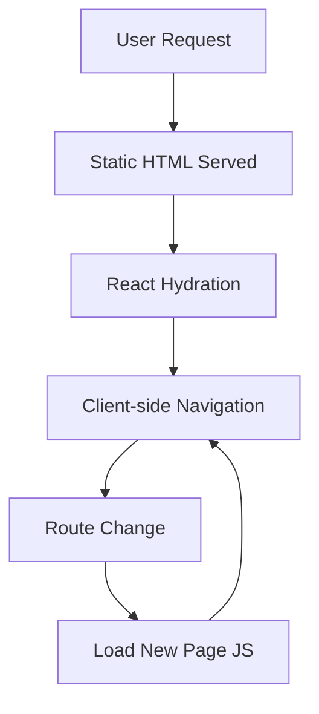
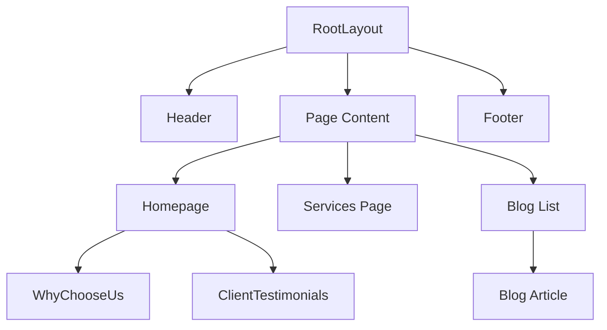

# Architecture Documentation

## Project Overview

SolanaLink Frontend is a statically generated Next.js 15 application built with React 19 and TypeScript. The application serves as a marketing website for SolanaLink's IT consulting services, with a focus on blockchain, compliance, and modern web technologies.

## Technical Architecture

### Core Technologies

- **Framework**: Next.js 15.5.2 with App Router
- **UI Library**: React 19.1.0
- **Language**: TypeScript 5+
- **Styling**: Tailwind CSS 4 via PostCSS
- **Testing**: Vitest 2.0+ with React Testing Library
- **Build Tool**: Turbopack
- **Deployment**: Static export (SSG)

### Architecture Decisions

#### 1. Static Site Generation (SSG)

**Decision**: Use Next.js static export (`output: "export"`)

**Rationale**:
- No server runtime required
- Can be deployed to any static hosting (CDN, S3, Netlify, Vercel)
- Better performance and security
- Lower operational costs
- Perfect for marketing/content sites

**Trade-offs**:
- No server-side rendering capabilities
- Dynamic content requires client-side fetching
- Image optimization disabled (using native images)

#### 2. App Router Structure

**Decision**: Use Next.js 15 App Router instead of Pages Router

**Rationale**:
- Modern React features support (Server Components, Streaming)
- Better layouts and template system
- Improved routing with parallel routes and intercepting routes
- Built-in loading and error states
- Better TypeScript support

**Implementation**:
```
src/app/
├── layout.tsx          # Root layout wrapper
├── page.tsx            # Root page (redirects to /homepage/)
├── globals.css         # Global styles and theme
├── components/         # Shared components
└── [route]/page.tsx    # Individual pages
```

#### 3. Styling Architecture

**Decision**: Tailwind CSS 4 with CSS custom properties for theming

**Rationale**:
- Utility-first approach for rapid development
- Consistent design system
- Small bundle size (only used utilities)
- CSS custom properties for dynamic theming

**Theme Structure**:
```css
:root {
  /* Light mode tokens */
  --color-primary: #1173d4;
  --color-background: #ffffff;
  --color-text: #1a1a1a;
}

@media (prefers-color-scheme: dark) {
  :root {
    /* Dark mode tokens */
    --color-background: #0a0a0a;
    --color-text: #e0e0e0;
  }
}
```

#### 4. Component Architecture

**Decision**: Hybrid client/server component approach

**Rationale**:
- Server components by default for better performance
- Client components only when needed (interactivity, hooks)
- Clear separation of concerns

**Guidelines**:
- Pages: Server components
- Layout: Server component
- Header: Client component (navigation state)
- Footer: Server component
- Interactive features: Client components with "use client"

#### 5. Font Strategy

**Decision**: Three Google Fonts loaded via `next/font/google`

**Implementation**:
```typescript
const inter = Inter({ subsets: ["latin"] });
const geistMono = Geist_Mono({ subsets: ["latin"] });
const newsreader = Newsreader({ subsets: ["latin"] });
```

**Usage**:
- Inter: Primary UI font
- Geist Mono: Code and technical content
- Newsreader: Display headings and hero text

## Directory Structure

### Application Code (`src/app/`)

```
src/app/
├── components/              # Shared UI components
│   ├── Header.tsx          # Navigation component (client)
│   ├── Footer.tsx          # Footer component (server)
│   ├── WhyChooseUs.tsx     # Value props component
│   └── ClientTestimonials.tsx # Reviews component
│
├── layout.tsx              # Root layout with header/footer
├── globals.css             # Global styles and theme
├── page.tsx                # Root page (redirect)
│
├── homepage/               # Main landing page
├── our-services/           # Services overview
├── about-us/               # Company information
├── contact-us/             # Contact details
├── compliance-and-investigations/ # Specialized services
├── news-and-blog-list/     # Blog listing
│   └── [slug]/            # Dynamic blog routes
├── industries/             # Industry verticals (placeholder)
├── case-studies/           # Project showcases (placeholder)
└── careers/                # Job opportunities (placeholder)
```

### Configuration Files

```
Root Directory
├── next.config.ts          # Next.js configuration
├── tailwind.config.ts      # Tailwind CSS settings (placeholder)
├── tsconfig.json           # TypeScript configuration
├── vitest.config.ts        # Test runner configuration
├── eslint.config.mjs       # ESLint rules
├── postcss.config.mjs      # PostCSS with Tailwind
├── package.json            # Dependencies and scripts
├── Dockerfile              # Container configuration
└── docker-compose.yml      # Container orchestration
```

### Testing Structure

```
src/
├── __tests__/              # Unit test files
│   ├── Header.test.tsx
│   ├── Footer.test.tsx
│   ├── WhyChooseUs.test.tsx
│   └── ClientTestimonials.test.tsx
└── test/
    └── setup.ts            # Test configuration
```

## Data Flow

### Page Rendering Flow



### Component Hierarchy



## Build Process

### Development Build

```bash
npm run dev
```
- Uses Turbopack for fast HMR
- Runs on http://localhost:3000
- Enables React Strict Mode
- Source maps enabled

### Production Build

```bash
npm run build
```

1. **TypeScript Compilation**: Type checking
2. **Static Generation**: Pre-renders all pages
3. **Optimization**:
   - Code splitting
   - Tree shaking
   - Minification
4. **Output**: Static files in `out/` directory

### Build Output Structure

```
out/
├── _next/              # Next.js assets
│   ├── static/        # JS/CSS bundles
│   └── data/          # JSON data
├── homepage/           # Static HTML pages
├── our-services/
├── about-us/
├── contact-us/
├── compliance-and-investigations/
├── news-and-blog-list/
│   └── [article-slugs]/
├── 404.html           # Error page
└── index.html         # Root redirect
```

## Performance Optimizations

### 1. Static Generation
- All pages pre-rendered at build time
- No server-side processing needed
- Instant page loads from CDN

### 2. Code Splitting
- Automatic code splitting by route
- Lazy loading of components
- Reduced initial bundle size

### 3. Font Optimization
- Fonts loaded via `next/font`
- Automatic font display swap
- Subset loading for performance

### 4. Image Strategy
- Native image loading (no Next.js optimization)
- Lazy loading with `loading="lazy"`
- Proper sizing and formats

### 5. CSS Optimization
- Tailwind CSS purging unused styles
- CSS modules for component styles
- Critical CSS inlining

## Security Considerations

### 1. Static Site Benefits
- No server-side vulnerabilities
- No database connections
- No API keys in frontend

### 2. Content Security
- All content pre-rendered
- No user-generated content
- No dynamic data fetching

### 3. Headers Configuration
- Strict CSP headers (via hosting)
- X-Frame-Options
- X-Content-Type-Options

## Deployment Architecture

### Static Hosting Options

#### CDN Deployment
```
CloudFront/Fastly
       |
    S3 Bucket
       |
   Static Files
```

#### Platform Deployment
```
Vercel/Netlify
       |
   Edge Network
       |
   Static Files
```

### Container Deployment

```dockerfile
# Multi-stage build
FROM node:20 AS builder
# Build static files

FROM nginx:alpine
# Serve static files
```

## State Management

### Current State
- Minimal client-side state
- Navigation state in Header component
- No global state management needed

### Future Considerations
If dynamic features are added:
- Consider React Context for global state
- Zustand for complex state management
- React Query for server state

## Testing Strategy

### Unit Testing
- Component rendering tests
- Props validation
- Accessibility checks
- User interaction simulation

### Test Structure
```typescript
describe('Component', () => {
  it('renders correctly', () => {
    // Rendering test
  });

  it('handles user interaction', () => {
    // Interaction test
  });

  it('meets accessibility standards', () => {
    // A11y test
  });
});
```

### Coverage Goals
- Components: 80%+ coverage
- Utilities: 100% coverage
- Pages: Smoke tests

## Monitoring and Analytics

### Current Implementation
- Basic meta tags for SEO
- Structured data (JSON-LD)
- Open Graph tags

### Recommended Additions
1. Google Analytics 4
2. Error tracking (Sentry)
3. Performance monitoring (Web Vitals)
4. User behavior analytics

## Maintenance and Updates

### Regular Maintenance
1. Dependency updates (monthly)
2. Security patches (as needed)
3. Content updates (ongoing)
4. Performance audits (quarterly)

### Upgrade Path
- Next.js minor versions: Test and update
- React major versions: Full regression testing
- Tailwind major versions: Review breaking changes

## Development Workflow

### Branch Strategy
```
main
  ├── feature/new-feature
  ├── fix/bug-fix
  └── chore/maintenance
```

### CI/CD Pipeline
1. Push to branch
2. Run linting
3. Run tests
4. Build static site
5. Deploy preview (PRs)
6. Deploy to production (main)

## Future Architecture Considerations

### Potential Enhancements

1. **Content Management**
   - Headless CMS integration
   - Markdown/MDX support
   - Dynamic routing

2. **Internationalization**
   - Full i18n support
   - Multiple language versions
   - Locale-based routing

3. **Progressive Web App**
   - Service worker
   - Offline support
   - App manifest

4. **API Integration**
   - Client-side data fetching
   - Form submissions
   - Real-time features

5. **Performance**
   - Image optimization service
   - Edge computing
   - Advanced caching strategies

## Conclusion

The SolanaLink Frontend architecture is designed for simplicity, performance, and maintainability. The static site approach provides excellent performance and security while keeping operational complexity minimal. The modern tech stack ensures developer productivity and code quality, while the modular component architecture allows for easy maintenance and updates.