# SolanaLink Frontend

A modern, professional static marketing website for SolanaLink built with Next.js 15 (App Router), React 19, TypeScript, and Tailwind CSS 4. The site is fully static (no server runtime) and deployable to any static hosting provider.

## 🚀 Overview

SolanaLink Frontend is a high-performance marketing website showcasing IT services across cloud computing, e-commerce, web development, blockchain, and compliance domains. Built with cutting-edge technologies and optimized for static deployment, it delivers excellent user experience with minimal infrastructure requirements.

### Key Features

- **Static Site Generation** - Fully static export with no server runtime required
- **Modern Tech Stack** - Next.js 15, React 19, TypeScript, Tailwind CSS 4
- **Responsive Design** - Mobile-first approach with adaptive layouts
- **SEO Optimized** - Metadata, structured data, sitemap, and canonical URLs
- **Internationalization** - Japanese language support with bilingual content
- **Accessibility** - ARIA attributes, skip links, and keyboard navigation
- **Testing Coverage** - Unit tests with Vitest and React Testing Library
- **CI/CD Ready** - GitHub Actions workflow with automated testing and builds
- **Docker Support** - Containerized development and deployment options

### Services Showcased

1. **Cloud Computing Solutions**
   - Cloud Migration Services
   - Infrastructure Management
   - Monitoring & Optimization

2. **E-commerce Development**
   - Online Storefront Setup
   - Payment & Logistics Integration
   - SEO & Performance Optimization

3. **Web Application Development**
   - Custom Web Applications
   - CMS & Editorial Workflows
   - Performance & Accessibility

4. **Blockchain Technology**
   - Smart Contract Development
   - Decentralized Applications (dApps)
   - Cryptocurrency Integration

5. **Compliance & Security**
   - AML/KYT Screening
   - Business KYC
   - Blockchain Investigations
   - Regulatory Compliance
   - Cybersecurity Audits

## 🏗️ Architecture

```mermaid
flowchart TD
  A[Browser] --> B["Next.js 15 App Router"]
  B --> C["Static Export<br/>(out/)"]
  C --> D["Static Hosting<br/>(CDN/Netlify/Vercel/S3)"]

  B --> E["Pages & Routes"]
  E --> E1["Root - Redirect to Homepage"]
  E --> E2["Homepage - Marketing Hero"]
  E --> E3["Our Services - 5 Service Categories"]
  E --> E4["About Us - Company Info"]
  E --> E5["Contact Us - Personal Contact"]
  E --> E6["Compliance & Investigations"]
  E --> E7["News & Blog List - 4 Articles"]
  E7 --> E8["Blog Article (Dynamic Routing)"]
  E --> E9["Industries (Placeholder)"]
  E --> E10["Case Studies (Placeholder)"]
  E --> E11["Careers (Placeholder)"]

  B --> F["Shared Components"]
  F --> F1["Header - Navigation"]
  F --> F2["Footer - Sitemap"]
  F --> F3["WhyChooseUs - Value Props"]
  F --> F4["ClientTestimonials - Reviews"]

  B --> G["Styling System"]
  G --> G1["Tailwind CSS 4"]
  G --> G2["Custom Theme Tokens"]
  G --> G3["Dark/Light Mode"]

  B --> H["Quality Assurance"]
  H --> H1["Vitest + RTL"]
  H --> H2["ESLint"]
  H --> H3["TypeScript Strict"]
```



### Configuration Highlights

```typescript
// next.config.ts
{
  output: "export",           // Fully static site generation
  trailingSlash: true,        // Directory-based routing
  images: { unoptimized: true } // Native images for static export
}
```

## 💻 Technology Stack

### Core Framework
- **Next.js 15** - React framework with App Router
- **React 19** - UI library with latest features
- **TypeScript** - Type-safe development
- **Node.js 20** - Runtime environment

### Styling & Design
- **Tailwind CSS 4** - Utility-first CSS via PostCSS
- **Custom Theme Tokens** - CSS custom properties for theming
- **Google Fonts** - Inter (UI), Geist Mono (code), Newsreader (display)
- **Responsive Design** - Mobile-first approach

### Development Tools
- **Turbopack** - Fast development builds
- **ESLint** - Code quality with Next.js rules
- **Vitest** - Modern test runner
- **React Testing Library** - Component testing
- **Coverage Reports** - HTML, LCOV, text formats

### Infrastructure
- **Docker** - Multi-stage containerization
- **GitHub Actions** - CI/CD pipeline
- **Static Hosting** - CDN-ready deployment

## 📁 Project Structure

```
solanalink-frontend/
├── src/
│   ├── app/                    # Next.js App Router
│   │   ├── components/         # Shared UI components
│   │   │   ├── Header.tsx      # Navigation with active states (8 links + CTA)
│   │   │   ├── Footer.tsx      # Sitemap and social links
│   │   │   ├── WhyChooseUs.tsx # Three value propositions
│   │   │   └── ClientTestimonials.tsx # Three customer reviews with ratings
│   │   ├── layout.tsx          # Root layout wrapper
│   │   ├── globals.css         # Global styles & theme
│   │   ├── page.tsx            # Root redirect to /homepage/
│   │   ├── homepage/           # Main landing page with hero section
│   │   ├── our-services/       # 5 service categories detailed
│   │   ├── about-us/           # Mission, vision, history, team
│   │   ├── contact-us/         # Personal contact (Tony) with social links
│   │   ├── compliance-and-investigations/ # AML/KYC services
│   │   ├── news-and-blog-list/ # Blog listing with 4 articles
│   │   │   └── [slug]/         # Dynamic blog posts (4 pre-defined)
│   │   ├── industries/         # Placeholder - needs content
│   │   ├── case-studies/       # Placeholder - needs content
│   │   └── careers/            # Placeholder - needs content
│   ├── __tests__/              # Unit test files
│   └── test/setup.ts           # Test configuration
├── public/                     # Static assets
│   ├── robots.txt             # SEO crawler rules
│   ├── sitemap.xml            # Site structure for SEO
│   └── solanalink-logo.png   # Company logo
├── contents/                   # Research documentation
│   ├── AI-and-Blockchain-Career-Research.md
│   ├── AI-and-Blockchain-Integration-Analysis.md
│   ├── Deep-Research-Case-Study-Successes.md
│   └── Quantitative-Trading-Industry-Research.md
├── .github/workflows/          # CI/CD configuration
├── docker-compose.yml          # Container orchestration
├── Dockerfile                  # Container definition
├── next.config.ts             # Next.js configuration
├── tailwind.config.ts         # Tailwind CSS settings
├── vitest.config.ts           # Test runner setup
├── package.json               # Dependencies & scripts
└── CLAUDE.md                  # AI assistant guidance
```

## 🚀 Getting Started

### Prerequisites

- Node.js 20+ and npm 10+
- Git for version control
- Docker (optional) for containerized development

### Installation

1. Clone the repository:
```bash
git clone https://github.com/your-org/solanalink-frontend.git
cd solanalink-frontend
```

2. Install dependencies:
```bash
npm install
```

3. Start development server:
```bash
npm run dev
```

4. Open http://localhost:3000 in your browser

## 📝 Available Scripts

### Development
```bash
npm run dev          # Start dev server with Turbopack (localhost:3000)
npm run build        # Production build and static export to out/
npm start            # Serve production build locally
npx serve out        # Preview static export
```

### Testing
```bash
npm run test            # Run unit tests
npm run test:watch      # Watch mode for tests
npm run test:coverage   # Generate coverage reports
```

### Code Quality
```bash
npm run lint            # Run ESLint checks
```

### Docker Development
```bash
docker-compose up --build  # Build and run in container
```

## 🧪 Testing Strategy

The project uses **Vitest** with **React Testing Library** for comprehensive testing:

### Test Coverage
- **Header Component**: Brand name, navigation links, aria-current attributes, CTA button
- **Footer Component**: Brand name rendering, sitemap links validation
- **WhyChooseUs Component**: Value proposition rendering
- **ClientTestimonials Component**: Customer review rendering
- Navigation state management testing with active page detection
- Accessibility attribute validation (aria-labels, aria-current)

### Running Tests
```bash
# Run all tests
npm run test

# Watch mode during development
npm run test:watch

# Generate coverage report
npm run test:coverage
```

Coverage reports are generated in `coverage/` directory. Open `coverage/index.html` to view detailed reports.

### Test Structure Example
```typescript
describe('Header', () => {
  it('renders navigation links', () => {
    // Test implementation
  });

  it('marks current page with aria-current', () => {
    // Accessibility testing
  });
});
```

## 🚢 Deployment

### Static Export

1. Build the static site:
```bash
npm run build
```

2. The static files are generated in the `out/` directory

3. Deploy to your preferred static hosting provider:

#### Netlify
```bash
# Install Netlify CLI
npm install -g netlify-cli

# Deploy to Netlify
netlify deploy --dir=out --prod
```

#### Vercel
```bash
# Install Vercel CLI
npm install -g vercel

# Deploy to Vercel
vercel --prod
```

#### GitHub Pages
```bash
# Using gh-pages package
npm install --save-dev gh-pages
npx gh-pages -d out
```

#### AWS S3 + CloudFront
```bash
# Sync to S3 bucket
aws s3 sync out/ s3://your-bucket-name --delete

# Invalidate CloudFront cache
aws cloudfront create-invalidation --distribution-id YOUR_DIST_ID --paths "/*"
```

### Docker Deployment

Build and run the Docker container:
```bash
# Build the image
docker build -t solanalink-frontend .

# Run the container
docker run -p 3000:80 solanalink-frontend
```

Using Docker Compose:
```bash
docker-compose up --build
```

## 🔄 CI/CD Pipeline

GitHub Actions workflow (`.github/workflows/ci.yml`) automates:

1. **Trigger**: Push/PR to main branch
2. **Environment**: Node.js 20
3. **Steps**:
   - Install dependencies (`npm ci`)
   - Lint code (`npm run lint`)
   - Run tests with coverage (`npm run test:coverage`)
   - Build static site (`npm run build`)
   - Upload artifacts (coverage + static export)

## 🎨 Development Guidelines

### Code Style
- **TypeScript** with strict mode enabled
- **2-space indentation**
- **ESM imports only** (no CommonJS)
- **PascalCase** for React components
- **kebab-case** for directories
- **Utility-first** Tailwind CSS approach

### Component Development
```typescript
// Example component structure
"use client"; // Only when client interactivity needed

export default function ComponentName() {
  return (
    <div className="utility-classes">
      {/* Component content */}
    </div>
  );
}
```

### Commit Convention
```bash
type(scope): subject

# Examples:
feat(header): add mobile navigation
fix(blog): correct article routing
docs(readme): update deployment instructions
test(footer): add accessibility tests
```

## 🌐 SEO & Performance

### SEO Features
- **Static Site Generation** for fast loading
- **Metadata Management** per page
- **Structured Data** (JSON-LD)
- **Canonical URLs**
- **Open Graph tags**
- **Sitemap.xml** and **robots.txt**

### Performance Optimizations
- **Static export** with CDN compatibility
- **Minimal JavaScript** bundle
- **Font display swap** for web fonts
- **Trailing slashes** for proper routing
- **Turbopack** for fast development builds

### Updating SEO Assets
1. Edit `public/sitemap.xml` with your domain
2. Update `public/robots.txt` if needed
3. Configure metadata in each page component

## 🔧 Configuration Files

### Key Configurations
- `next.config.ts` - Next.js settings and static export
- `tailwind.config.ts` - Tailwind CSS customization
- `vitest.config.ts` - Test runner configuration
- `eslint.config.mjs` - Linting rules
- `tsconfig.json` - TypeScript compiler options
- `postcss.config.mjs` - PostCSS with Tailwind

## 📚 Documentation

- **README.md** - This file (project overview)
- **CLAUDE.md** - AI assistant guidance for development
- **AGENTS.md** - Development conventions and guidelines

## 🤝 Contributing

1. Fork the repository
2. Create a feature branch (`git checkout -b feature/amazing-feature`)
3. Commit your changes (`git commit -m 'feat: add amazing feature'`)
4. Run tests and linting (`npm run test && npm run lint`)
5. Push to the branch (`git push origin feature/amazing-feature`)
6. Open a Pull Request

## 🐛 Known Issues & Roadmap

### Current Limitations
- **Placeholder Pages**: Industries, Case Studies, and Careers pages need content
- **Static Blog System**: 4 articles hardcoded in TypeScript (no CMS)
- **No Blog Search**: Blog content not searchable
- **External Contact**: Contact form links to external services (LINE, Twitter, LinkedIn, GitHub)
- **Social Media Links**: Footer contains placeholder social links
- **Missing Tailwind Config**: Using inline theme in globals.css instead of tailwind.config.ts

### Future Enhancements
- [ ] Complete placeholder pages (Industries, Case Studies, Careers)
- [ ] Content Management System integration for blog
- [ ] Blog search functionality
- [ ] Enhanced form handling with backend integration
- [ ] Progressive Web App features
- [ ] Advanced analytics integration
- [ ] Multi-language support expansion
- [ ] Proper Tailwind configuration file
- [ ] Implement actual social media links
- [ ] Expand test coverage for all pages
- [ ] Add loading states and error boundaries
- [ ] Implement proper image optimization workflow

## 📄 License

This project is licensed under the MIT License - see the [LICENSE](LICENSE) file for details.

## 🔗 Resources

- [Next.js Documentation](https://nextjs.org/docs)
- [React Documentation](https://react.dev)
- [Tailwind CSS v4](https://tailwindcss.com/docs)
- [Vitest Documentation](https://vitest.dev)
- [TypeScript Handbook](https://www.typescriptlang.org/docs/)

## 💡 Support

For questions or support, please contact the development team or open an issue in the repository.

---

Built with ❤️ by the SolanaLink development team